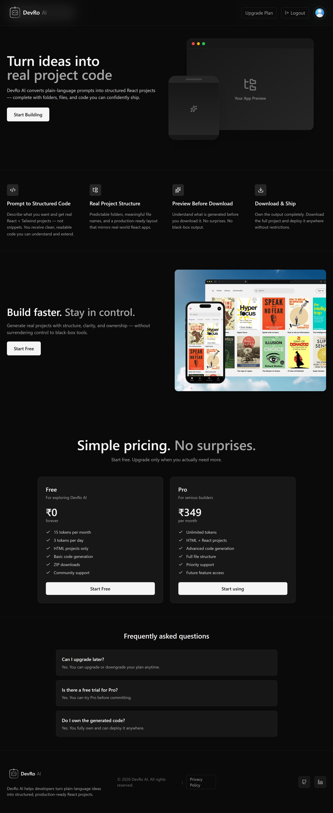
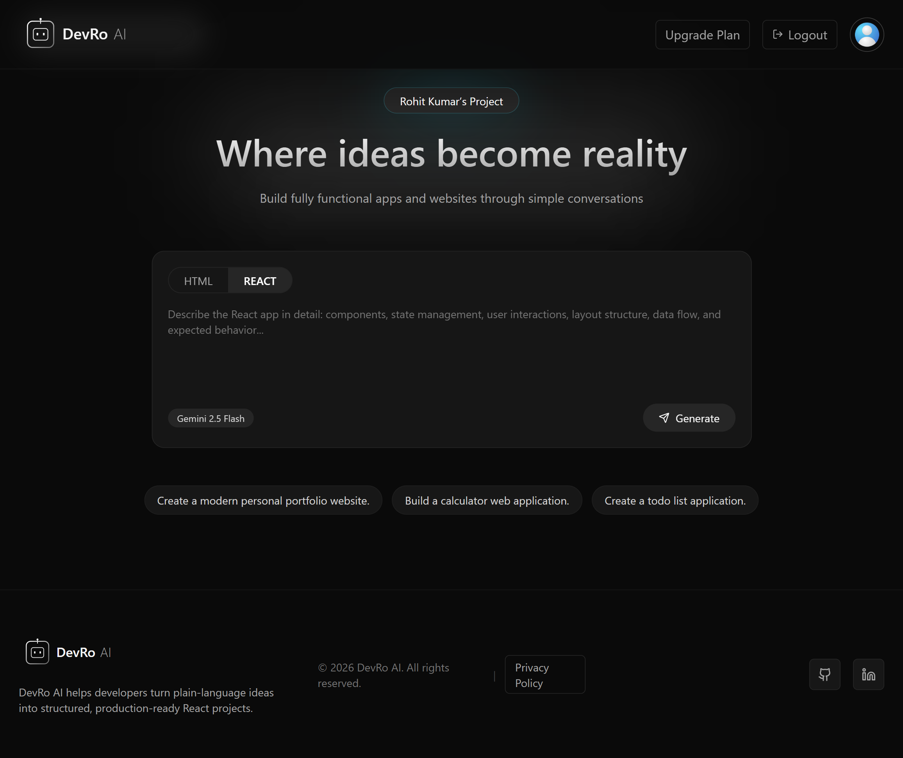
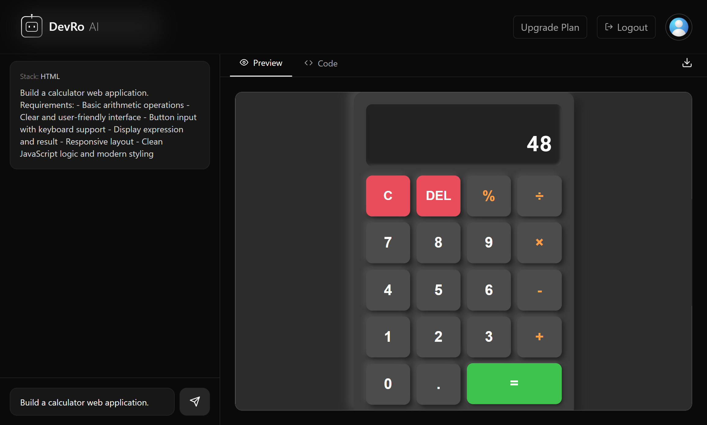
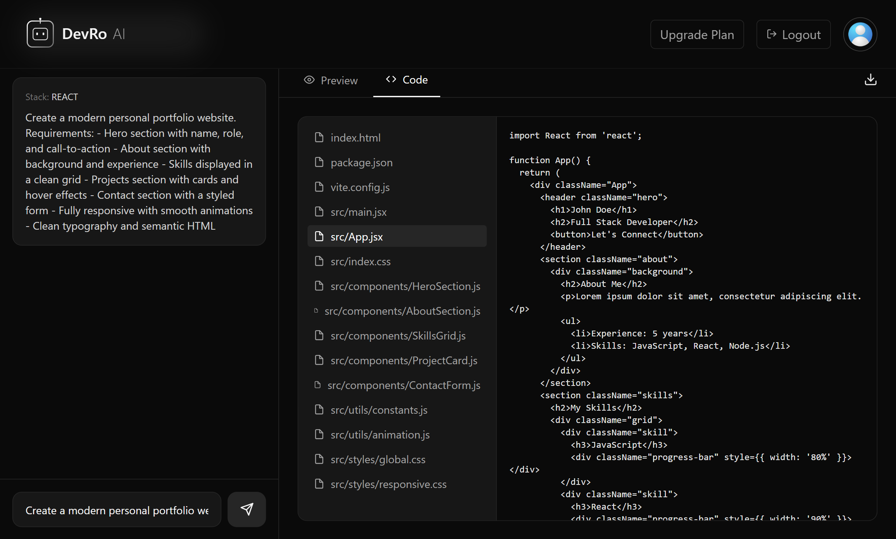
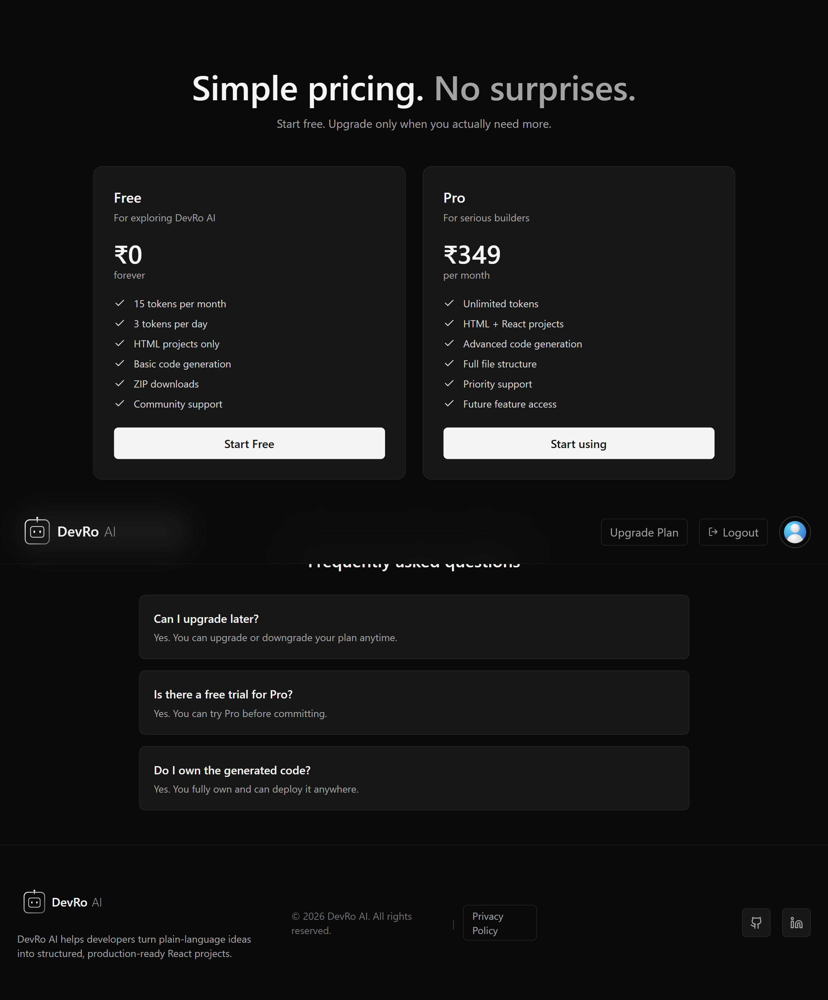
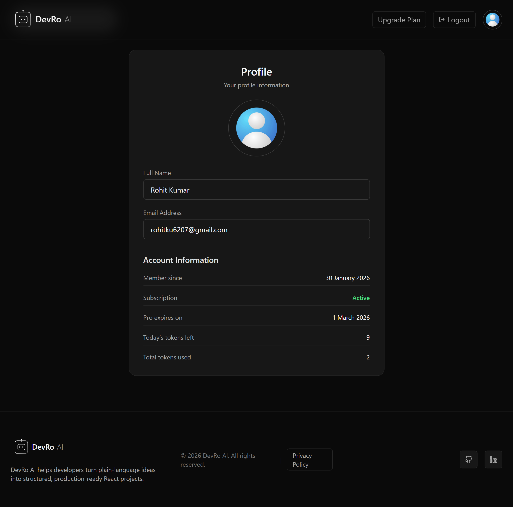

<h1 align="center">DevRo AI — Prompt-to-Code Platform</h1>

  DevRo AI is an AI-powered web platform that converts natural language prompts into
  <b>fully styled HTML websites</b> or <b>complete React project structures</b>.

---

<h2 align="center">🌐 Live Deployment</h2>

  Deployed on <b>Vercel</b> 
  <a href="https://devro-ai.vercel.app/">https://devro-ai.vercel.app/</a>

---

<h2 align="center">🧠 How DevRo AI Works</h2>

  DevRo AI uses <b>two different AI engines</b>, each chosen for what it does best:

<table align="center">
  <tr>
    <th>Stack</th>
    <th>AI Engine</th>
    <th>Why</th>
  </tr>
  <tr>
    <td align="center">HTML</td>
    <td align="center">Gemini 2.5 Flash</td>
    <td align="center">Strong UI, CSS, animations, live preview</td>
  </tr>
  <tr>
    <td align="center">React</td>
    <td align="center">Groq (llama-3.1-8b-instant)</td>
    <td align="center">Fast, scalable, code-only generation</td>
  </tr>
</table>

---

<h2 align="center">✨ Key Features</h2>

  🔤 Prompt → Project generation 
  🌐 Single-file HTML websites with live preview 
  ⚛️ Full React + Vite project structure 
  📁 Real downloadable file trees (ZIP) 
  🔐 Authentication & plan-based access 
  💳 Razorpay payment integration (test mode)

---

<h2 align="center">🖼️ Application Preview</h2>

<h3 align="center">🔹 Main Pages</h3>

  
  

<h3 align="center">🔹 Coding Experience</h3>

  
  

<h3 align="center">🔹 User & Pricing</h3>

  
  

---

<h2 align="center">🛠️ Tech Stack</h2>

<table align="center">
  <tr>
    <th>Frontend</th>
    <th>AI & APIs</th>
    <th>Auth & Payments</th>
    <th>Deployment</th>
  </tr>
  <tr>
    <td align="center">
      React + Vite 
      Tailwind CSS 
      Framer Motion
    </td>
    <td align="center">
      Gemini 2.5 Flash 
      Groq API
    </td>
    <td align="center">
      Firebase Auth 
      Razorpay (test mode)
    </td>
    <td align="center">
      Vercel 
      Environment Variables
    </td>
  </tr>
</table>

---

<h2 align="center">🧩 Architecture Highlights</h2>

  AI responsibilities are <b>clearly separated</b> 
  Live preview only where technically valid 
  Rate-limit-safe multi-step generation 
  Built around real developer workflows

---

<h2 align="center">👤 Author</h2>

  <b>Rohit Kumar</b> 
  Developer & Builder

  <a href="https://github.com/Rohitsaw6207">GitHub</a> ·
  <a href="https://www.linkedin.com/in/rohit-kumar-saw6207/">LinkedIn</a>

---

<h2 align="center">📜 License</h2>

  This project is built for learning, experimentation, and portfolio use.

